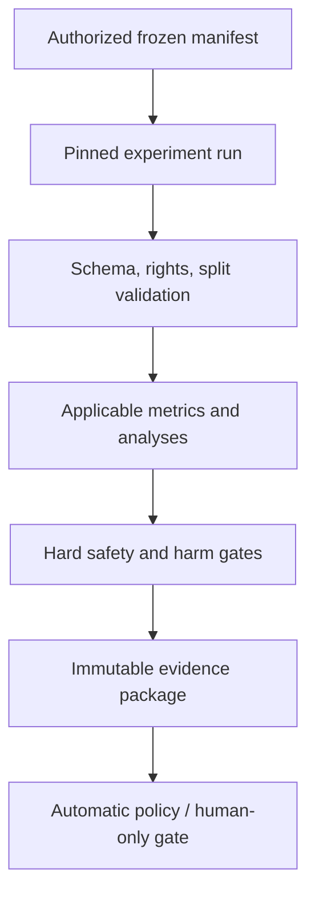

# Autonomous Quality Lab Specification

**Status:** canonical v1.0  
**Purpose:** continuously produce reproducible engineering evidence while preventing automation from manufacturing scientific confidence.

## Responsibilities

- Build/select rights-authorized test manifests.
- Run champion and approved challengers in isolated pinned environments.
- Measure registered applicable endpoints and operational budgets.
- Execute adversarial, metamorphic, golden, corpus, and listening-analysis validation.
- Produce immutable result packages, diffs, regressions, and review proposals.
- Trace results to risks, decisions, milestones, and claims.

It does not recruit participants, grant rights, tune on confirmatory data, approve claims, adopt challengers, or publish.

## Pipeline

## Run specification

Each run freezes experiment/protocol, code commit/build, dependency lock/SBOM, native runtime fingerprints, OS/hardware, configuration, seeds, manifest/split, treatment/comparator, metric registry, budget, and expected output schema. Network is off unless explicitly needed and logged. Inputs are read-only; outputs are run-scoped.

## Suites

1. **Static/schema:** source, type, license, manifest, evidence, claim, and migration validators.
2. **Unit/property:** finite samples, bounds, determinism, idempotence, monotonic controls, safe error handling.
3. **Adversarial semantics:** duplicates, ties, side bias, panel cancellation, missing results, corrupt identities, leakage, expired rights.
4. **Audio goldens/metamorphic:** exact or tolerance comparison, silence/impulse/sine/noise/extreme duration/rate/channel cases.
5. **Synthetic corpus:** known transforms, detector sensitivity/specificity/calibration, processor recovery, errors.
6. **Rights-clean real corpus:** held-out strata and collateral harms.
7. **Listening analysis:** frozen raw/assignment fixtures and preregistered model replay.
8. **Performance/reliability:** CPU/RSS/disk/cancel/crash/restart/determinism/platform.
9. **Security/supply chain:** dependency advisories, artifact hashes/signatures, unsafe parser/resource cases.

## Champion/challenger

The production champion is explicit. A challenger has a readiness card covering purpose, rights, data, code/weights, security, resource needs, explainability, failure fallback, and evaluation. It runs on disjoint frozen data. Promotion requires all hard gates, prespecified material benefit, no launch-stratum harm, resource compliance, reproducible result, rollback proof, and human decision. Promotion creates a new champion identity; it never overwrites history.

## Result semantics

Statuses are `passed`, `failed`, `unsafe`, `harmful_tradeoff`, `indeterminate`, `not_applicable`, `error`, `cancelled`, or `quarantined`. The lab never converts errors/skips/missing rights into passes. Summaries retain denominators and independent units.

## Baselines and regressions

Golden updates require a reason, before/after evidence, reviewer, affected claims, and audio-review need. A result may improve a target yet regress collateral/performance; the diff shows both. Flaky/non-deterministic results are quarantined and investigated, never rerun until green without disclosure.

## Reproducibility and retention

Result packages are content-addressed and include machine-readable summary plus human report. Sensitive audio retention follows grants; reproducibility may use authorized private references plus non-sensitive hashes/manifests. Corrections append. Retention expiry can invalidate claim eligibility.

## Human gates

Required for rights overrides, external data, paid studies, metric/threshold changes after data, golden adoption with audible change, challenger promotion, production/release, and claim approval. The lab emits exactly the evidence needed for each gate.
