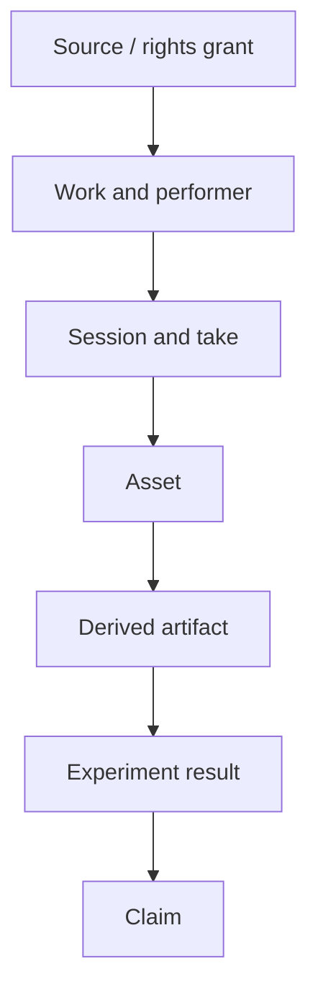

# Data, Evidence, and Provenance Specification

**Status:** canonical v1.0

## Invariants

1. No asset is used without an explicit purpose authorization.
2. Unknown rights fail closed.
3. Original evidence is immutable; corrections and transformations append linked records.
4. Identity groups prevent leakage and enable withdrawal.
5. Code, model weights, training data, datasets, and generated outputs have separate rights/provenance.
6. A result or claim is reproducible from identities or is labeled non-reproducible.

## Identity graph

Every node has stable ID, schema version, hash where applicable, creation/ingestion time, owner, status, and provenance edges. Group identities exist even when personal identity is pseudonymized.

## Rights grant

Record licensor/authority, evidence-document identity/hash/location, license/contract/consent version, effective/expiry dates, territory, attribution, restrictions, and permission state for:

- storage and internal processing;
- development/tuning;
- evaluation/benchmarking;
- model training/fine-tuning;
- model/feature/embedding retention and distribution;
- audio/stem/clip redistribution;
- public examples and result publication;
- commercial use;
- derivative works;
- claim support;
- future research/contact;
- withdrawal/deletion requirements.

Each permission is `allowed`, `prohibited`, `conditional`, `unknown`, or `expired`, with conditions. A broad license never silently fills an unreviewed purpose.

## Asset manifest

Include source, work/song, performer/singer, session, take, engineer, acquisition, original filename only in protected storage, content hash, duration, channels, rate/encoding, language/genre/vocal/style/recording strata, quality flags, transformations, split group, consent/rights IDs, sensitivity, retention, publication status, and known duplicates.

## Derivation

Every derived artifact identifies all parents, ordered transform/code/build/config/model identities, random seed, start/end offsets, manual operations, output hash, and purpose. Non-deterministic transforms record environment and uncertainty. Dataset manifests are selections over asset IDs with frozen query/version and exclusion reasons.

## Split integrity

Define train/tune/pilot/validation/confirmatory/public-demo splits at the highest leakage group required—normally source, performer, work, and session. Split assignment precedes derived augmentation. A validator rejects shared protected group IDs and near-duplicate fingerprints across disjoint splits.

## Experiment and evidence

An experiment links protocol/preregistration, data selection/split, treatment/comparator, software/config, metric/listening assignments, results, deviations, rights decision, and reviewer. A result records applicability, status, effect/uncertainty, independent counts, slices, harms, errors, and claim eligibility. Published summaries link immutable result IDs.

## Consent withdrawal and deletion

Withdrawal creates an immutable event. The system traverses descendants, classifies delete/rebuild/review/retract actions, pauses prohibited use/claims, records approvals, executes recoverably, and verifies absence. Models/features require a documented unlearning/retrain or retention decision consistent with the grant. Historical audit may retain non-identifying proof of the deletion event where permitted.

## Access and privacy

Direct identity/contact and consent documents are separated from pseudonymous research data. Least privilege and access audit apply. Shareable manifests omit direct identifiers and sensitive paths. Retention schedules are machine-testable. Logs never contain raw audio or direct identity by default.

## Validation

Schema and graph validators enforce required fields, hashes, enumerations, grant-purpose authorization, expired/withdrawn state, duplicate identity, split leakage, broken derivations, orphan evidence, and claim dependencies. Quarantined data cannot enter production or confirmatory evidence.

## Migration

Current schema `1.0.0` records are imported as legacy nodes with `unknown` fields; missing rights are not inferred. Synthetic fixtures retain their generator/config provenance. M29 consent drafts remain unapproved grant templates until signed review.
