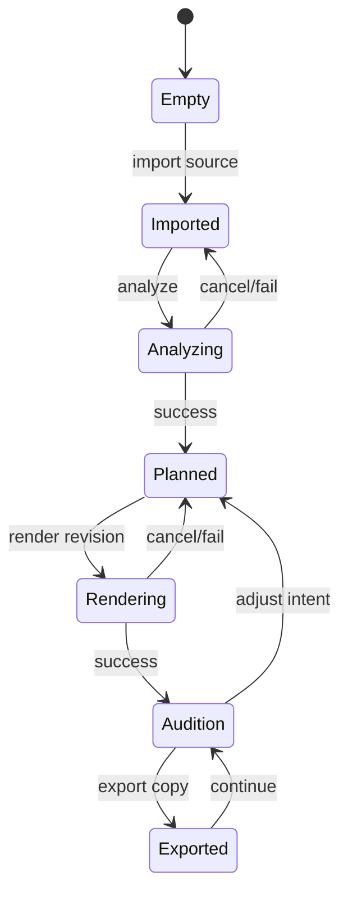

# Desktop UX and Project Model Specification

**Status:** canonical v1.0  
**Distribution:** internal source-run only until D-015 is accepted and release gates pass

## Experience principles

Local by default; original always safe; scope and confidence visible; audition before export; every action reversible; technical detail available but not required; no dark patterns around upload, telemetry, claims, or rights.

## Primary workflow and states

Every transition is atomic. Interrupted jobs reopen as interrupted with recovery actions, never succeeded.

## Screens/regions

- Project/open/recent with privacy and missing-file handling.
- Import/preflight with source properties, support limits, and non-destructive statement.
- Findings with applicability/confidence and “not analyzed/unknown” states.
- Proposed plan with ordered actions, rationale, protected attributes, strength, details.
- Render progress with stage, elapsed/estimate where calibrated, cancel, resource warning.
- Audition with original/revision, bypass, level match, loop, synchronized waveform/timeline where helpful, blind mode for studies.
- Revision/history and export with warnings, format, destination, provenance option.
- Settings/about with local/telemetry defaults, build/SBOM/notices, diagnostics export/redaction.

## Project schema

Required fields: schema/project ID, creation/update, app/build, title, local privacy mode, source asset ID/fingerprint and managed/relative reference, working representation transform, intent revisions, analyses, plans, render revisions, audition state, exports, interrupted jobs, migration history, and content hashes. Direct participant identities, credentials, and arbitrary machine paths are not embedded in shareable projects.

## Asset and revision behavior

Original is immutable. Import may copy into managed storage or retain a reference by explicit user choice; fingerprint detects changes. Every render is a new revision linked to plan/build/config/input. Deleting a revision is recoverable where practical and never deletes source. Missing/moved sources can be relinked only after fingerprint verification.

## Intent controls

Initial controls are bounded repair/control intents such as steady noise reduction, tonal harshness control, peak/dynamic control, and overall strength within safety ranges. Show automatic recommendation and user delta. Reset and bypass are immediate. Creative style or accompaniment-fit controls do not appear in cleanup mode.

## Audition integrity

Record loudness-match method and latency alignment. Switching is click-free and synchronized. Users can disable level match with explanation when absolute level is relevant. Visuals never disclose blind assignment during a study. Audition state does not alter exported audio silently.

## Errors and recovery

Errors contain stage, user-safe reason, affected artifact, recovery actions, correlation ID, and whether source/project is safe. Corrupt/unsupported input, disk full, permission denied, cancellation, dependency failure, crash, and migration failure have tested flows. Diagnostics export is redacted and opt-in.

## Accessibility

All actions keyboard accessible; focus/status announced; progress and outcomes not color-only; scalable text; high contrast; waveform is supplementary; labels avoid unexplained jargon; motion optional; blind-study integrity remains compatible with assistive technology.

## Performance UX

Before work begins, validate duration/disk/memory budgets. Progress is stage-based and honest; estimates appear only when calibrated. Cancellation meets a defined latency budget. UI remains responsive during processing. Background work does not start without an explicit command.

## Validation

Use target-user task studies for import, interpretation, audition, recovery, and export. Measure success, critical errors, time, comprehension of limitations, original-safety confidence, and ability to detect/recover from a deliberately poor plan. Audio preference is a separate protocol.

## Deferred scope

Multi-track/context playback, batch, cloud sync, collaboration, plugin/real-time, advanced automation, accounts, mobile, marketplace, and training on user audio require separate product/evidence/security decisions.
