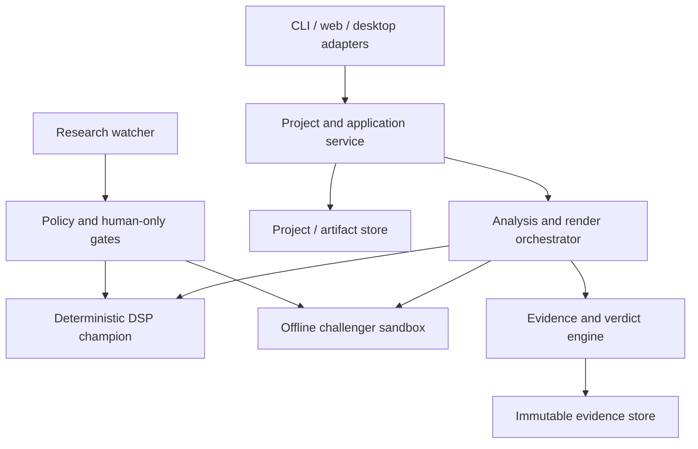

# System Architecture

**Status:** canonical target architecture v1.0  
**Migration strategy:** strangler evolution around the deterministic champion

## Context

The architecture separates user/product state, audio computation, evidence, research, and distribution. Interfaces carry immutable identities and explicit failure/applicability states. UI layers never infer a quality verdict from raw metric dictionaries.

## Bounded contexts

### Project and application service

Owns project lifecycle, atomic commands, progress/cancellation, revisions, source preservation, export, and adapter-neutral errors. CLI/web/desktop translate inputs only. No audio algorithm writes project state directly.

### Audio asset service

Probes/decodes, fingerprints, validates, records source format, and creates explicit working representations. Conversion to mono/44.1 kHz/16-bit is a versioned transform, never silent source identity.

### Analysis and intent

Produces typed observations with applicability/confidence and accepts immutable intent/protected attributes. It does not mutate audio or declare quality.

### Decision planning

Produces an ordered, versioned, bounded plan with rationale, assumptions, constraints, and rollback. Current v2 planner is the initial implementation behind the interface.

### DSP runtime

`DspBackend` describes processor capabilities, parameter schemas, streaming/state requirements, latency, license identity, and render. Current Pedalboard execution is one backend. Golden contracts compare replacement candidates.

### Evidence and verdict engine

Executes registered measurements/studies, validates applicability and provenance, records uncertainty/slices/errors, enforces harm/safety rules, and links outcomes to claim eligibility. It cannot be bypassed by UI wording.

### Challenger sandbox

Offline only. Models/candidate processors run in isolated experiments against champion outputs using pinned artifacts. They cannot become production dependencies without rights, validity, performance, security, rollback, and human gates.

### Provenance and rights

Stores immutable identities, rights/consent versions, derivation edges, splits, experiments, results, corrections, deletion events, and claim dependencies. The runtime asks for purpose authorization before use.

### Research watcher

Fetches official metadata into immutable snapshots and emits review proposals. It cannot modify canonical state or install/adopt artifacts.

## Core contracts

Every command/result uses a stable ID, schema version, created-at, producer build, configuration identity, input identities, status (`pending/running/succeeded/failed/cancelled`), structured errors, and content hash. Unknown and inapplicable values are explicit sum types, not null/zero overloads.

Complete illustrative records for evaluation, verdicts, rights, withdrawal, listening responses, experiments, claims, and watcher proposals are canonicalized in [`IMPLEMENTATION_SCHEMA_EXAMPLES.md`](IMPLEMENTATION_SCHEMA_EXAMPLES.md).

## Storage

- Project metadata: transactional local database or atomic versioned documents; migration-tested.
- Audio: content-addressed/managed files with original immutable and derived revisions.
- Evidence: append-only result packages with correction/supersession edges.
- Secrets/identity map: separate protected store; not embedded in shareable projects.
- Temporary files: project-scoped restrictive permissions, quotas, crash cleanup.

## Operational requirements

Deterministic job keys enable idempotency. Cancellation is cooperative and bounded. Writes stage then atomically commit. The project opens after crash and explains interrupted work. Logs use correlation IDs and redact audio/path/participant data by default.

## Migration order

1. Characterize current behavior and define identities/evidence.
2. Wrap existing orchestration/DSP; do not change sound.
3. Add project/application service and atomic storage.
4. Replace evaluation semantics and listening infrastructure.
5. Decide distribution and UI stack.
6. Build internal desktop vertical slice.
7. Add data/listening evidence and only then challengers.

## Architecture decision gates

DSP/backend and UI/package choices remain reversible until D-015 is accepted. No desktop view imports Pedalboard directly. No model can access user projects for training. Hosted upload and local project implementations share evidence contracts but retain separate security boundaries.
