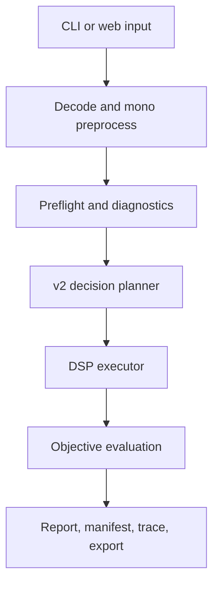

# Current-State Code and Architecture Audit

**Baseline:** `a3c51637a0c2ed18994a6950a45a72ccb753a93d`  
**Method:** repository/history inspection, fresh environment, tests, representative v2 render, artifact trace.  
**Verdict:** healthy deterministic prototype; evidence and product boundaries need hardening before feature expansion.

## Verified architecture

The CLI’s v2 default and explicit legacy branch are verified. Diagnostics are separated into safety, loudness, spectral, and advisory domains; decision planning creates an ordered transform plan; DSP execution uses Pedalboard-backed processors plus repository code; reporting captures a substantial trace.

## Strengths to preserve

- Deterministic execution and reproducible fixture/golden checks.
- Clear analysis → decision → render shape.
- Conservative guardrails and explicit fallback behavior.
- Reports/manifests that expose actions rather than hiding them.
- 360 passing tests and six audio regression goldens at baseline.

## Findings

| ID | Severity | Finding | Evidence | Required response |
|---|---|---|---|---|
| CA-01 | Critical | Evaluation truth is not typed strongly enough to support claims. | Generic objective dictionaries; no applicability/uncertainty/claim linkage. | DT-45–DT-48 |
| CA-02 | High | Always converting to 44.1 kHz/16-bit mono creates a hard product boundary that documentation can blur. | Preprocessing flow and channel warning. | Declare scope; preserve source identity; design stereo/context separately. |
| CA-03 | High | Dataset and processing records lack full source/subject/session/take/experiment identity graphs. | Current schema `1.0.0`. | DT-49 |
| CA-04 | High | DSP implementation/license is coupled to product distribution. | Pedalboard import/use; GPL-3.0. | Adapter boundary and branch decision. |
| CA-05 | High | Whole-buffer operations create desktop scaling risk. | Performance report and historical MemoryErrors. | Instrument and design chunking. |
| CA-06 | Medium | CLI, web, and future desktop need a shared application/project service. | Script-driven orchestration and web job layer. | Introduce service after contracts freeze. |
| CA-07 | Medium | Dependency metadata is not a reproducible environment. | Lower bounds only; no lock/build fingerprint. | Lock, SBOM, exact FFmpeg identity. |
| CA-08 | Medium | Historical docs contain behavior drift. | Legacy-default paragraph; “362 tests” ambiguity. | Canonical state pointers and doc checks. |

## Recommended evolution

Do not rewrite the engine. First freeze behavior with characterization tests. Add typed identities/evidence beside existing outputs, then route them through a shared application service. Place current DSP behind an interface. Preserve legacy and current output comparison until migration acceptance. Desktop UI consumes the service only after distribution and project contracts are decided.

## Not verified

The live hosted deployment was not independently reachable during this audit. No conclusion is made about production availability, configuration, retention execution, or current combined GitHub status.
