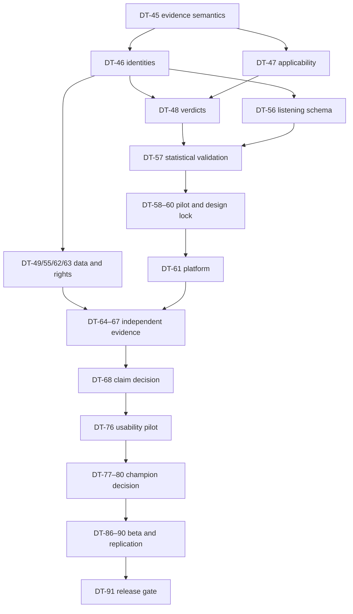

# Dependency Graph and Critical Path

**Authority:** validated derived topology view; YAML registry dependencies win on conflict.

## Critical path

The longest evidence-to-release chain is:

Desktop distribution joins the path through `DT-50 → DT-51 → DT-71 → DT-72–DT-75 → DT-76`. Rights-clean data joins through `DT-46 → DT-49 → DT-55 → DT-62 → DT-63`. The release cannot bypass either branch.

## Parallelizable research/build lanes

After DT-45, DT-46, DT-47, DT-50, and DT-53 can proceed in parallel when ownership permits. After stable identities, rights work (DT-49) and listening schema work (DT-56) can proceed independently. After DT-52/53, performance characterization (DT-70) can run while protocol/data gates mature. DT-83 can be implemented after DT-45/50 without waiting for model work, but DT-84 consumes the integrated system.

## Serial integrity constraints

- Analysis method is frozen before pilot; pilot precedes power/threshold lock; lock precedes confirmatory collection.

> **Dependency audit (2026-07-24, DT-57/55/58 groundwork).** The order is verified
> correct and needs no change: DT-57 (analysis method) → DT-58 → DT-59 (pilot) →
> DT-60 (power + threshold LOCK) → DT-66/DT-67 (confirmatory; both depend on DT-60).
> Freeze precedes confirmatory collection. **Explicit guard on the DT-59→DT-60
> boundary:** the pilot is non-confirmatory and its data may inform ONLY the
> confirmatory sample size `n` (via variance). Endpoints, direction, estimand, and
> exclusions are fixed in the DT-57 preregistration content-hash lock
> (`src/analysis/prereg.py`); thresholds (δ, α) are set at DT-60 BEFORE any
> confirmatory data. Pilot results must never redefine endpoints/thresholds
> (post-hoc guard, `test_post_hoc_endpoint_change_breaks_the_lock`). Corpus
> collection (DT-62) is likewise gated behind the DT-55 rights plan, and tuning
> (DT-64) never accesses confirmatory groups (grouped-split leakage control, DT-63).
- Acquisition/rights precede grouped splits; splits precede calibration/studies; tuning never accesses confirmatory groups.
- Distribution decision precedes framework/build; performance budget precedes long-file optimization; reliable workflow precedes usability pilot.
- Evidence/failure taxonomy precedes quality preregistration; implementation precedes frozen comparison; comparison precedes RC freeze.
- Beta RC freezes before execution; packaging/operations and beta precede replication; replication precedes public claims.

## Readiness rule

Only the canonical YAML registry can make a milestone ready/in progress. Dependency completion is necessary but not sufficient: applicable rights, resource, evidence, and true human-only gates must also be satisfied. This package begins with none in progress and DT-45 as the only ready milestone. After DT-45, up to four dependency-independent lanes may run under [the autonomy and parallel-execution policy](AUTONOMY_AND_PARALLEL_EXECUTION.md).
